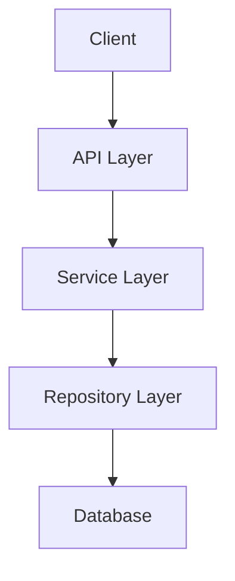

# FluentCMS Documentation Guidelines

This document outlines the documentation standards and best practices for the FluentCMS project.

## Documentation Requirements

-   Update relevant documentation in /docs when modifying features
-   Keep README.md in sync with new capabilities
-   Maintain changelog entries in CHANGELOG.md

## 1. General Documentation Principles

### 1.1 Purpose
- All documentation should clearly explain **why** something exists, not just what it is.
- Documentation should be written with the audience in mind (developers, contributors, end-users).
- Update documentation whenever changes are made to the corresponding code or feature.

### 1.2 Clarity
- Use clear, concise language.
- Define technical terms the first time they appear.
- Use active voice instead of passive voice.
- Include examples for complex concepts.

## 2. Code Documentation

### 2.1 XML Documentation
- All public APIs must have XML documentation.
- XML documentation should be more than just type information that the compiler already knows.
- Include meaningful descriptions that explain concepts and considerations.
- Document example usage where appropriate.

```csharp
/// <summary>
/// Retrieves an entity by its unique identifier.
/// </summary>
/// <param name="id">The unique identifier of the entity to retrieve.</param>
/// <returns>
/// The entity with the specified ID, or null if no entity is found.
/// </returns>
/// <exception cref="ArgumentNullException">Thrown when <paramref name="id"/> is null.</exception>
/// <remarks>
/// This method queries the database directly and does not use any caching mechanism.
/// </remarks>
public async Task<TEntity> GetById(string id)
```

### 2.2 Code Comments
- Add inline comments for complex algorithms or business rules.
- Comment "why" the code does something, not "what" it does (the code itself shows what).
- Keep comments up-to-date when code changes.

## 3. Markdown Documentation

### 3.1 Structure
- Use a consistent hierarchy of headers:
  - `#` for document title
  - `##` for major sections
  - `###` for subsections
  - `####` for sub-subsections
- Include a table of contents for documents longer than 500 lines.
- Use bullet points and numbered lists appropriately.

### 3.2 Formatting
- Use **bold** for emphasis on important terms.
- Use *italics* for secondary emphasis.
- Use `code blocks` for code snippets, command-line examples, and file paths.
- Use triple backticks with language identifier for multi-line code:

````markdown
```csharp
public class Example
{
    public void Method() 
    {
        // Code here
    }
}
```
````

### 3.3 Documentation Files
- `README.md` - Every project and major directory should have a README.
- `CONTRIBUTING.md` - Guidelines for contributing to the project.
- `ARCHITECTURE.md` - Overview of system architecture and design decisions.
- Documentation directories should use lowercase names (e.g., `docs/` or `documentation/`).

### 3.4 Links and References
- Use relative links for references to other documentation files within the repository.
- Use absolute links for external resources.
- Verify all links work before committing documentation changes.

## 4. API Documentation

### 4.1 REST API Documentation
- Document all API endpoints with:
  - HTTP method
  - URL pattern
  - Description
  - Request parameters/body
  - Response format
  - Error responses
  - Authentication requirements
  - Example requests and responses

### 4.2 API Documentation Format
- Consider using OpenAPI/Swagger for REST API documentation.
- Include example requests and responses in documentation.

```markdown
## Get Entity

`GET /api/entities/{id}`

Retrieves a single entity by its ID.

### Parameters

| Name | Type | In | Required | Description |
|------|------|----|----|-------------|
| id | string | path | Yes | The entity ID |

### Responses

| Status | Description |
|--------|-------------|
| 200 | Successfully retrieved entity |
| 404 | Entity not found |
| 500 | Server error |

### Example

Request:
```http
GET /api/entities/123 HTTP/1.1
Host: api.example.com
Authorization: Bearer token123
```

Response:
```json
{
  "id": "123",
  "name": "Example Entity",
  "created": "2023-01-01T12:00:00Z"
}
```
```

## 5. Architecture Documentation

### 5.1 System Overview
- Document high-level architecture with diagrams.
- Explain key components and their interactions.
- Include information about design patterns used.

### 5.2 Diagrams
- Use diagrams to explain complex workflows or architectures.
- Consider using Mermaid for diagrams in Markdown:

````markdown

````

### 5.3 Decision Records
- Document important architectural decisions.
- Include context, options considered, and reasoning for the chosen solution.
- Use a consistent format for decision records.

## 6. Repository Documentation

### 6.1 README Content
- Project overview and purpose
- Prerequisites
- Installation instructions
- Configuration
- Basic usage examples
- Development setup
- Testing instructions
- Contribution guidelines

### 6.2 Project Structure
- Document the project structure and purpose of key directories.

```markdown
## Project Structure

- `src/` - Source code
  - `FluentCMS.Entities/` - Core domain entities
  - `FluentCMS.Repositories.Abstractions/` - Repository interfaces
  - `FluentCMS.Repositories.{Provider}/` - Provider-specific implementations
- `tests/` - Test projects
- `docs/` - Documentation
```

## 7. User Documentation

### 7.1 User Guides
- Write clear step-by-step instructions.
- Include screenshots for UI-related features.
- Group related tasks together.

### 7.2 Troubleshooting
- Include a troubleshooting section for common issues.
- Provide clear error messages and their resolutions.

## 8. Versioning Documentation

### 8.1 Changelog
- Maintain a `CHANGELOG.md` file.
- Follow the [Keep a Changelog](https://keepachangelog.com/) format.
- Group changes by type: Added, Changed, Deprecated, Removed, Fixed, Security.

### 8.2 Version Compatibility
- Document breaking changes between versions.
- Provide migration guides for major version upgrades.
- Include deprecation notices for features planned to be removed.
