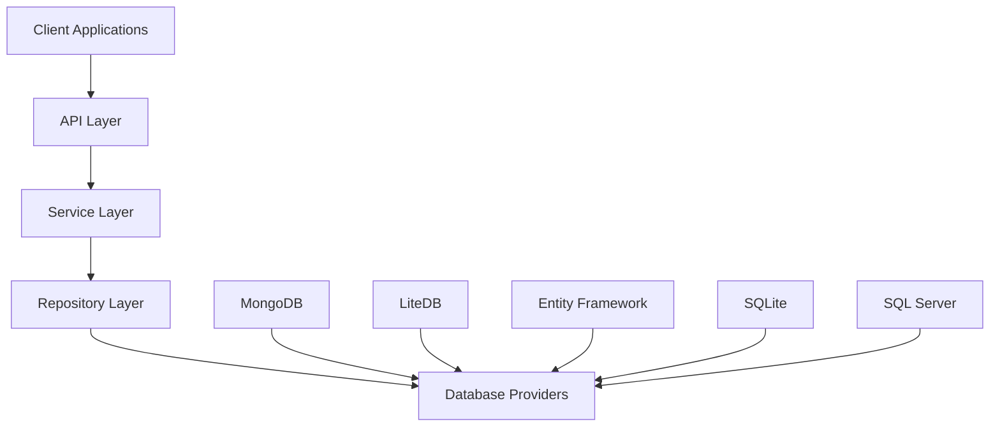

# FluentCMS

[](LICENSE)

A flexible, headless Content Management System backend built with ASP.NET Core, supporting multiple database providers through a unified repository pattern.

## Overview

FluentCMS is a modern, modular headless CMS backend that provides API-based content management capabilities. It separates content management from presentation concerns, allowing for seamless integration with various frontend technologies. The system is designed with a focus on flexibility, extensibility, and developer experience.

Key aspects:
- Built with ASP.NET Core
- Multiple database provider support
- Repository pattern for data access abstraction
- Focused on RESTful API design principles
- Future Blazor Server frontend planned

## Features

### Core Components (Available)
- 🏗️ Generic repository pattern implementation
- 📦 Multiple database provider support
- 🔄 Consistent API regardless of underlying database
- 📝 Audit tracking for entity changes
- ⚡ Asynchronous operations throughout

### Database Providers
- ✅ MongoDB implementation
- ✅ LiteDB implementation
- 🚧 Entity Framework Core support (coming soon)
- 🚧 SQLite support (coming soon)
- 🚧 SQL Server support (coming soon)

### Planned Features
- 📋 Content type definitions
- 🔍 Advanced content querying
- 📱 RESTful API for content management
- 🔐 Authentication and authorization
- 🖼️ Media management
- 👥 User management
- 🎛️ Blazor-based administration UI

## Architecture

FluentCMS follows a clean architecture approach with clear separation of concerns:

```
Client Applications → API Layer → Service Layer → Repository Layer → Database Providers
```

The repository pattern serves as the core architectural component, providing a consistent abstraction over various database technologies:



## Getting Started

### Prerequisites
- .NET 8.0 SDK or later
- Visual Studio 2022 or Visual Studio Code
- Database of your choice (MongoDB, LiteDB, SQL Server, or SQLite)

### Setup

1. Clone the repository:
```bash
git clone https://github.com/yourusername/FluentCMS.git
cd FluentCMS
```

2. Restore dependencies:
```bash
dotnet restore
```

3. Configure your database provider (see Configuration section)

4. Build the solution:
```bash
dotnet build
```

## Configuration

### MongoDB Configuration

```csharp
// Program.cs or Startup.cs
services.AddMongoDbRepositories(options =>
{
    options.ConnectionString = "mongodb://localhost:27017";
    options.DatabaseName = "FluentCMS";
    options.UseCamelCaseCollectionNames = true;
});
```

### LiteDB Configuration

```csharp
// Program.cs or Startup.cs
services.AddLiteDbRepositories(options =>
{
    options.ConnectionString = "Filename=fluentcms.db;Connection=shared";
});
```

## Documentation

For more detailed documentation, please refer to:

- `/docs` - Additional documentation (coming soon)
- Code comments - All public APIs are documented with XML comments

## Roadmap

Please see the [project roadmap](memory-bank/progress.md) for detailed development plans.

### Short-term (1-2 Months)
1. Complete remaining database provider implementations
2. Design and implement content type system
3. Create service layer with business logic
4. Set up initial API endpoints

### Medium-term (3-6 Months)
1. Implement authentication and authorization
2. Develop media management capabilities
3. Add advanced querying and filtering
4. Set up comprehensive API documentation

### Long-term (6+ Months)
1. Build Blazor server frontend
2. Implement admin UI for content management
3. Create user management system
4. Develop templates and themes system

## Contributing

Contributions are welcome! Please feel free to submit a Pull Request.

## License

This project is licensed under the MIT License - see the [LICENSE](LICENSE) file for details.
