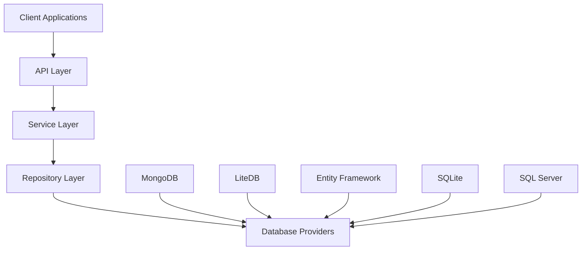
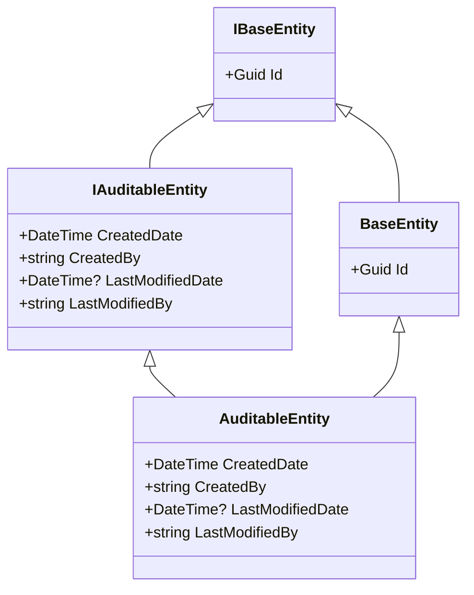
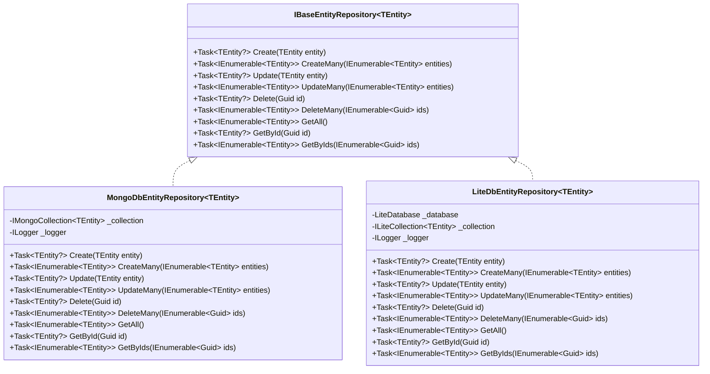
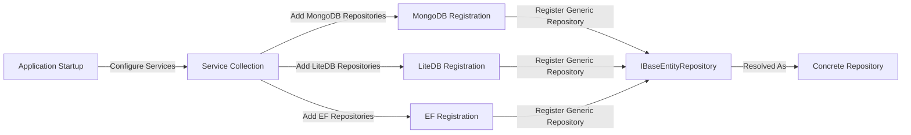

# FluentCMS System Patterns

## System Architecture

FluentCMS follows a clean architecture approach with clear separation of concerns across different layers. The architecture is designed with modularity and flexibility as core principles.

### Key Components

1. **Entities Layer**
   - Foundation models defining the domain objects
   - Independent of data access or business logic concerns
   - Contains base entity classes and interfaces

2. **Repository Abstractions Layer**
   - Defines interfaces for data access operations
   - Separates data access concerns from business logic
   - Enables multiple repository implementations

3. **Repository Implementations**
   - Concrete implementations of repository interfaces for specific database providers
   - Encapsulates database-specific logic and operations
   - Provides consistent API regardless of underlying technology

4. **Service Layer** (To be implemented)
   - Will contain business logic and application-specific operations
   - Will enforce business rules and validate operations
   - Will orchestrate repository operations

5. **API Layer** (To be implemented)
   - Will expose HTTP endpoints for consuming applications
   - Will handle authentication, authorization, and request validation
   - Will transform between API models and domain entities

## Key Technical Decisions

### 1. Repository Pattern

**Decision:** Implement a repository pattern with abstraction layer and multiple concrete implementations.

**Rationale:**
- Provides a consistent interface for data access operations
- Allows for switching database providers without changing application code
- Enables unit testing through mock implementations
- Follows separation of concerns principle

### 2. Generic Repository Interface

**Decision:** Use generic interfaces for repositories with type constraints.

**Rationale:**
- Reduces code duplication across entity types
- Enforces consistent operations across all entities
- Allows for type-safe operations with compile-time checking
- Simplifies addition of new entity types

### 3. Multiple Database Providers

**Decision:** Support multiple database technologies through separate implementation projects.

**Rationale:**
- Provides flexibility for different deployment scenarios
- Allows leveraging specific database features when appropriate
- Prevents technology lock-in
- Accommodates various performance and scaling requirements

### 4. Auditable Entity Pattern

**Decision:** Implement an auditable entity base class with tracking fields.

**Rationale:**
- Ensures consistent auditing across entities
- Centralizes audit implementation details
- Simplifies reporting and compliance requirements
- Provides valuable metadata for troubleshooting and analysis

### 5. Dependency Injection

**Decision:** Use ASP.NET Core's built-in dependency injection container.

**Rationale:**
- Follows modern ASP.NET Core practices
- Promotes loose coupling between components
- Simplifies unit testing through interface-based abstractions
- Provides lifecycle management for services

## Design Patterns in Use

### 1. Repository Pattern

The repository pattern is the core architectural pattern used throughout the system. It provides an abstraction layer between the data access logic and the business logic.

**Implementation Details:**
- `IBaseEntityRepository<TEntity>` defines the contract for data operations
- Concrete implementations like `MongoDbEntityRepository<TEntity>` provide database-specific logic
- Repository methods return entities rather than database-specific objects

### 2. Options Pattern

Used for configuration of database providers through classes like `MongoDbOptions`.

**Implementation Details:**
- Options classes contain configuration properties
- IOptions<T> is injected into repositories
- Extension methods provide fluent configuration syntax

### 3. Factory Method Pattern

Used implicitly through dependency injection to create appropriate repository instances.

**Implementation Details:**
- Service collection extensions register appropriate repositories
- DI container resolves the correct implementation at runtime
- Factory methods in extension classes encapsulate creation logic

### 4. Decorator Pattern (Potential Future Use)

Could be used to add cross-cutting concerns like caching, logging, or performance monitoring to repositories.

**Potential Implementation:**
- Decorator classes implementing the same interface as the repositories
- Additional functionality added before/after calling the original method
- Registered in DI container to wrap original repositories

## Component Relationships

### Entity Hierarchy

### Repository Relationships

### Dependency Injection Flow

## Architecture Principles

1. **Separation of Concerns**
   - Each component has a single responsibility
   - Data access logic is separate from business logic
   - Repository implementations are isolated from each other

2. **Dependency Inversion**
   - High-level modules depend on abstractions
   - Low-level modules depend on the same abstractions
   - Implementations are provided through DI container

3. **Interface Segregation**
   - Repository interfaces define cohesive sets of operations
   - Clients depend only on operations they use
   - Future extensions can be made through new interfaces

4. **Open/Closed Principle**
   - Architecture is open for extension
   - New repositories can be added without modifying existing code
   - New entity types can use existing repositories through generics
