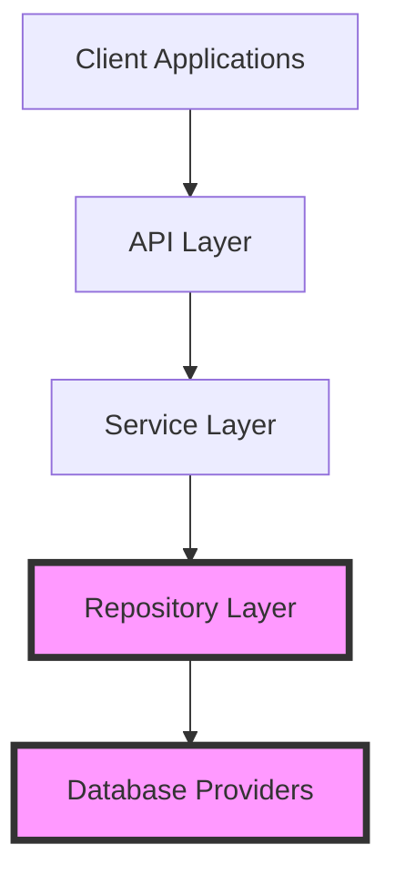

# FluentCMS Repositories Project Brief

## Purpose

The Repositories sub-project focuses on implementing the repository pattern for FluentCMS, with the primary goals of:

1. Creating a consistent data access abstraction across multiple database technologies
2. Isolating database-specific code from the rest of the application
3. Providing a clean API for entity operations
4. Enabling flexible database provider selection at configuration time

## Key Goals

1. **Provider Agnostic Interface**
   - Create a unified interface for data access operations
   - Enable application code to work with any database provider
   - Standardize entity operations across the system

2. **Multiple Database Support**
   - Implement MongoDB provider for document database scenarios
   - Implement LiteDB provider for embedded database scenarios
   - Implement Entity Framework providers for relational database scenarios
   - Support SQLite for file-based relational scenarios
   - Support SQL Server for enterprise relational scenarios

3. **Performance Optimization**
   - Optimize each provider for its specific database technology
   - Implement efficient batch operations
   - Manage connections and resources properly
   - Enable caching when appropriate

4. **Developer Experience**
   - Provide simple configuration options
   - Maintain consistent behavior across providers
   - Deliver clear error messages and logging
   - Supply comprehensive documentation and examples

## Success Criteria

1. All providers implement the full `IBaseEntityRepository<TEntity>` interface
2. Repository operations exhibit consistent behavior regardless of the provider
3. Configuration requires minimal effort through standardized options pattern
4. Integration tests pass across all database providers
5. Performance meets target benchmarks for basic operations

## Provider-Specific Requirements

### MongoDB Provider

- Connect to both local and remote MongoDB instances
- Support collection naming strategies
- Implement proper index creation
- Handle MongoDB-specific document ID management

### LiteDB Provider

- Support both file-based and in-memory modes
- Manage database file creation and access
- Implement proper resource disposal
- Configure performance options

### Entity Framework Core Provider

- Create a base implementation for EF Core
- Utilize EF Core's change tracking
- Support LINQ queries through IQueryable
- Enable configuration through DbContextOptionsBuilder

### SQLite Provider

- Extend EF Core provider for SQLite
- Support file path configuration
- Enable in-memory mode for testing
- Implement database creation and initialization

### SQL Server Provider

- Extend EF Core provider for SQL Server
- Support connection string configuration
- Enable server-specific features when appropriate
- Implement connection pooling optimization

## Integration with Backend

The Repositories sub-project is a critical component of the overall Backend, providing the data access layer that higher-level components will use. It specifically implements the Repository Layer from the overall architecture:

## Future Expansion

The repository pattern implementation is designed to eventually support:

1. Advanced querying capabilities through specification pattern
2. Pagination support for large datasets
3. Complex filtering and sorting operations
4. Event publishing for entity changes
5. Additional database providers as needed

See the [Backend project brief](../../memory-bank/projectbrief.md) for broader context on how repositories fit into the overall backend architecture.
