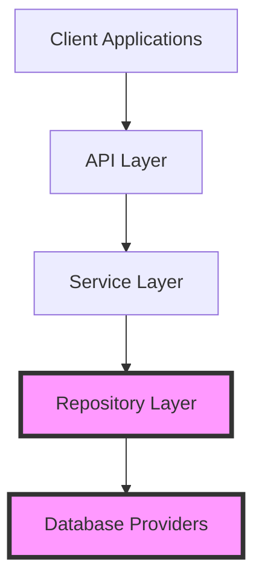

# FluentCMS Backend Project Brief

## Purpose

The Backend sub-project serves as the foundation for the FluentCMS system, providing:

1. Core entity definitions and models
2. Data access abstraction through repository patterns
3. Multiple database provider implementations
4. Infrastructure for future service and API layers

## Goals

1. **Repository Pattern Excellence**
   - Create a clean, consistent abstraction over data access operations
   - Support diverse database technologies through the same interface
   - Ensure type safety and compile-time checking
   - Maximize code reuse through generic implementations

2. **Database Provider Flexibility**
   - Provide feature-complete implementations for:
     - Document databases (MongoDB)
     - Embedded databases (LiteDB)
     - Relational databases (SQL Server, SQLite via Entity Framework)
   - Allow runtime switching between providers with minimal configuration

3. **Performance and Reliability**
   - Optimize data access operations for each provider
   - Implement proper error handling and logging
   - Ensure resource cleanup and connection management
   - Support asynchronous operations throughout

4. **Extensibility**
   - Design for future feature additions
   - Create extension points for custom repository operations
   - Allow for specialized repository interfaces when needed
   - Support pattern evolution as the system grows

## Success Criteria

1. All database providers pass the same integration test suite
2. Consistent performance across basic CRUD operations
3. Clean abstraction that doesn't leak implementation details
4. Comprehensive error handling and logging
5. Well-documented public APIs with examples

## Current Focus

The current development focus is completing the Entity Framework-based providers:
- Entity Framework Core base implementation
- SQLite provider built on Entity Framework
- SQL Server provider built on Entity Framework

## Relation to Main Project

This Backend sub-project implements the repository layer of the overall FluentCMS architecture:

The highlighted components (Repository Layer and Database Providers) represent the current scope of the Backend sub-project.

See the [main FluentCMS project brief](../../memory-bank/projectbrief.md) for overall project context.
