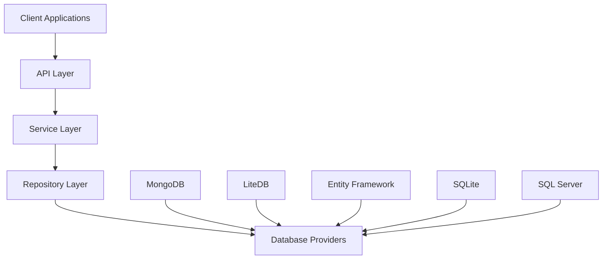
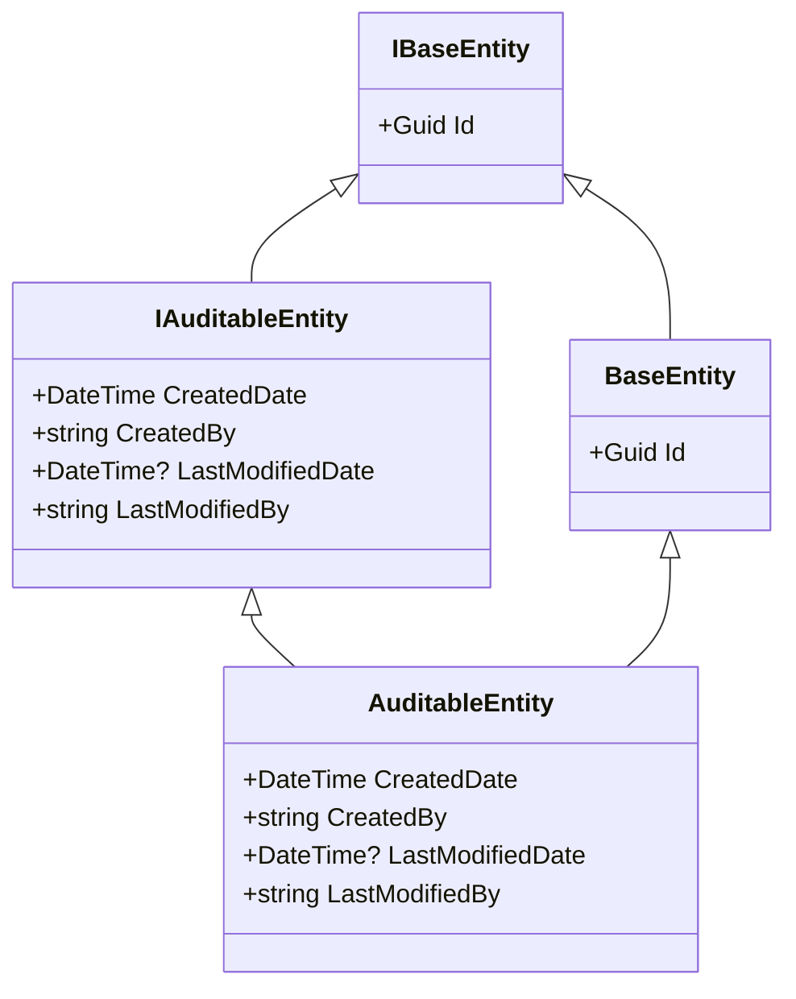

# Architecture Overview

## System Architecture

FluentCMS follows a clean architecture approach with clear separation of concerns across different layers. The architecture is designed with modularity and flexibility as core principles.



## Key Components

### 1. Entities Layer
- Foundation models defining the domain objects
- Independent of data access or business logic concerns
- Contains base entity classes and interfaces (`BaseEntity`, `AuditableEntity`)
- Provides the core data structures used throughout the system

### 2. Repository Abstractions Layer
- Defines interfaces for data access operations
- Separates data access concerns from business logic
- Enables multiple repository implementations
- Uses generic interfaces with type constraints

### 3. Repository Implementations
- Concrete implementations of repository interfaces for specific database providers
- Encapsulates database-specific logic and operations
- Provides consistent API regardless of underlying technology
- Currently includes MongoDB, LiteDB, EntityFramework, SQLite, and SQL Server implementations

### 4. Service Layer (Planned)
- Will contain business logic and application-specific operations
- Will enforce business rules and validate operations
- Will orchestrate repository operations
- Will provide higher-level abstractions for application use cases

### 5. API Layer (Planned)
- Will expose HTTP endpoints for consuming applications
- Will handle authentication, authorization, and request validation
- Will transform between API models and domain entities
- Will provide RESTful endpoints for content management

## Key Technical Decisions

### 1. Repository Pattern

The repository pattern is the core architectural pattern used throughout the system. It provides an abstraction layer between the data access logic and the business logic.

**Implementation Details:**
- `IBaseEntityRepository<TEntity>` defines the contract for data operations
- Concrete implementations like `MongoDbEntityRepository<TEntity>` provide database-specific logic
- Repository methods return entities rather than database-specific objects

**Benefits:**
- Provides a consistent interface for data access operations
- Allows for switching database providers without changing application code
- Enables unit testing through mock implementations
- Follows separation of concerns principle

### 2. Generic Repository Interface

Using generic interfaces for repositories with type constraints allows for code reuse while maintaining type safety.

**Implementation Details:**
```csharp
public interface IBaseEntityRepository<TEntity> where TEntity : class, IBaseEntity
{
    Task<TEntity?> Create(TEntity entity);
    Task<IEnumerable<TEntity>> CreateMany(IEnumerable<TEntity> entities);
    Task<TEntity?> Update(TEntity entity);
    Task<IEnumerable<TEntity>> UpdateMany(IEnumerable<TEntity> entities);
    Task<TEntity?> Delete(Guid id);
    Task<IEnumerable<TEntity>> DeleteMany(IEnumerable<Guid> ids);
    Task<IEnumerable<TEntity>> GetAll();
    Task<TEntity?> GetById(Guid id);
    Task<IEnumerable<TEntity>> GetByIds(IEnumerable<Guid> ids);
}
```

**Benefits:**
- Reduces code duplication across entity types
- Enforces consistent operations across all entities
- Allows for type-safe operations with compile-time checking
- Simplifies addition of new entity types

### 3. Multiple Database Providers

Support for multiple database technologies through separate implementation projects provides flexibility and prevents technology lock-in.

**Implementation Details:**
- Each provider (MongoDB, LiteDB, etc.) has its own implementation project
- All providers implement the same repository interfaces
- Configuration options for each provider allow customization

**Benefits:**
- Provides flexibility for different deployment scenarios
- Allows leveraging specific database features when appropriate
- Prevents technology lock-in
- Accommodates various performance and scaling requirements

### 4. Auditable Entity Pattern

The auditable entity pattern provides automatic tracking of creation and modification metadata.

**Implementation Details:**
- `IAuditableEntity` interface defines auditing properties
- `AuditableEntity` base class provides implementation
- Repository implementations handle setting audit fields

**Benefits:**
- Ensures consistent auditing across entities
- Centralizes audit implementation details
- Simplifies reporting and compliance requirements
- Provides valuable metadata for troubleshooting and analysis

### 5. Dependency Injection

Using ASP.NET Core's built-in dependency injection container provides loose coupling and lifecycle management.

**Implementation Details:**
- Service collection extensions register repositories and options
- Options pattern used for configuration
- Constructor injection used throughout

**Benefits:**
- Follows modern ASP.NET Core practices
- Promotes loose coupling between components
- Simplifies unit testing through interface-based abstractions
- Provides lifecycle management for services

## Entity Hierarchy



## Architecture Principles

### 1. Separation of Concerns
- Each component has a single responsibility
- Data access logic is separate from business logic
- Repository implementations are isolated from each other

### 2. Dependency Inversion
- High-level modules depend on abstractions
- Low-level modules depend on the same abstractions
- Implementations are provided through DI container

### 3. Interface Segregation
- Repository interfaces define cohesive sets of operations
- Clients depend only on operations they use
- Future extensions can be made through new interfaces

### 4. Open/Closed Principle
- Architecture is open for extension
- New repositories can be added without modifying existing code
- New entity types can use existing repositories through generics

## See Also

- [Repository Pattern](./Repository-Pattern.md) - Detailed information about the repository pattern implementation
- [Entity Model](./Entity-Model.md) - Information about the entity structure
- [Database Providers](./Database-Providers.md) - Overview of all database providers
- [Home](./Home.md) - Return to wiki home
