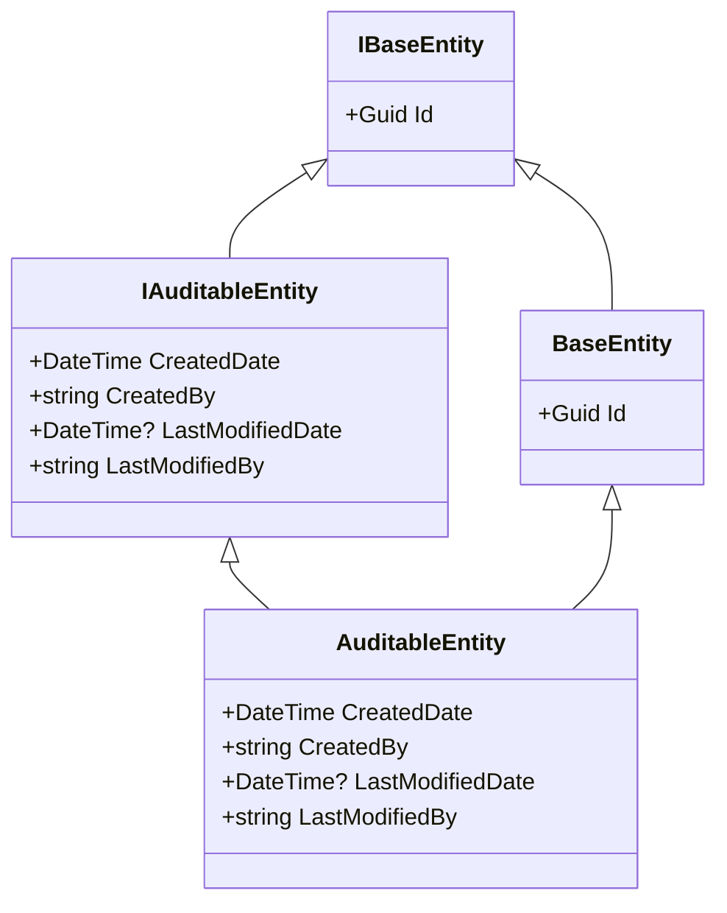

# Entity Model in FluentCMS

## Overview

The entity model in FluentCMS provides the foundation for all data structures in the system. It establishes a consistent approach to entity definition with built-in support for identity and auditing. This document outlines the core entity interfaces and base classes that form the backbone of the FluentCMS data model.

## Core Interfaces and Classes

### IBaseEntity

The fundamental interface that all entities must implement:

```csharp
public interface IBaseEntity
{
    Guid Id { get; set; }
}
```

**Key Characteristics:**
- Defines the `Id` property as a GUID (globally unique identifier)
- Serves as the minimal contract for any entity in the system
- Used as a generic constraint in repository interfaces

### BaseEntity

The base implementation of `IBaseEntity`:

```csharp
public abstract class BaseEntity : IBaseEntity
{
    public Guid Id { get; set; }
}
```

**Key Characteristics:**
- Provides a concrete implementation of the `Id` property
- Serves as the base class for non-auditable entities
- Abstracts ID generation details from derived entity classes

### IAuditableEntity

Interface for entities that require audit tracking:

```csharp
public interface IAuditableEntity : IBaseEntity
{
    DateTime CreatedDate { get; set; }
    string CreatedBy { get; set; }
    DateTime? LastModifiedDate { get; set; }
    string LastModifiedBy { get; set; }
}
```

**Key Characteristics:**
- Extends `IBaseEntity` with audit properties
- Tracks creation and modification metadata
- Uses nullable `LastModifiedDate` to distinguish between newly created and modified entities

### AuditableEntity

The base implementation of `IAuditableEntity`:

```csharp
public abstract class AuditableEntity : BaseEntity, IAuditableEntity
{
    public DateTime CreatedDate { get; set; }
    public string CreatedBy { get; set; }
    public DateTime? LastModifiedDate { get; set; }
    public string LastModifiedBy { get; set; }
}
```

**Key Characteristics:**
- Inherits from `BaseEntity` to include the `Id` property
- Implements `IAuditableEntity` interface
- Serves as the base class for all auditable entities in the system

## Entity Hierarchy

The entity model follows a clear inheritance hierarchy:



## Using the Entity Model

### Creating Domain Entities

When creating domain-specific entities, you should inherit from either `BaseEntity` or `AuditableEntity` depending on whether audit tracking is required:

```csharp
// Non-auditable entity
public class SimpleEntity : BaseEntity
{
    public string Name { get; set; }
    public string Description { get; set; }
}

// Auditable entity
public class ContentItem : AuditableEntity
{
    public string Title { get; set; }
    public string Content { get; set; }
    public bool IsPublished { get; set; }
}
```

### Working with Repository Operations

The entity interfaces are used as constraints in the repository pattern:

```csharp
public interface IBaseEntityRepository<TEntity> where TEntity : class, IBaseEntity
{
    // Repository methods...
}
```

This ensures that only valid entities can be used with the repositories.

## Handling Entity IDs

Entity IDs are managed consistently across all FluentCMS repositories:

- **ID Type**: All entities use `Guid` (UUID) as the ID type
- **ID Generation**: IDs are typically generated at the repository level before entity persistence
- **ID Immutability**: Once assigned, entity IDs should not be changed
- **Cross-Provider Consistency**: The same ID format works across all database providers

## Audit Tracking

For auditable entities, the audit fields are automatically populated by the repository implementations:

- **Creation**: `CreatedDate` and `CreatedBy` are set when an entity is first persisted
- **Modification**: `LastModifiedDate` and `LastModifiedBy` are updated on subsequent modifications
- **User Context**: The identity of the current user is obtained from the application context

## Design Considerations

### 1. ID Type Selection

The `Guid` type was chosen for entity IDs to ensure:
- Uniqueness across distributed systems
- No dependency on sequential database-generated IDs
- Consistent ID generation across all database providers
- No collisions when merging data from different sources

### 2. Interface Segregation

Separate interfaces (`IBaseEntity` and `IAuditableEntity`) allow for:
- Minimum required functionality in non-auditable entities
- Clear distinction between auditable and non-auditable entities
- Flexible generic constraints in repositories and services

### 3. Inheritance vs. Composition

Inheritance was chosen for the entity model to:
- Ensure consistent implementation across the system
- Reduce boilerplate code in entity classes
- Provide clear hierarchical organization
- Simplify repository implementation

## Planned Extensions

Future extensions to the entity model will include:

1. **Concurrency Support**: Adding concurrency tokens or version numbers
2. **Soft Delete**: Adding deletion tracking without physical removal
3. **Type Discrimination**: Support for entity type inheritance in databases
4. **Validation**: Built-in validation capabilities

## See Also

- [Architecture Overview](./Architecture-Overview.md) - System architecture and design principles
- [Repository Pattern](./Repository-Pattern.md) - Repository pattern implementation
- [Database Providers](./Database-Providers.md) - Database provider implementations
- [Home](./Home.md) - Return to wiki home
