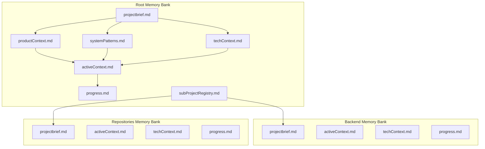

# Memory Bank System

## Overview

The Memory Bank is a specialized documentation system used in FluentCMS development that maintains project context between work sessions. Unlike traditional documentation that focuses on explaining how the system works, the Memory Bank is designed to track the current state, decisions, and progress of the project.

## Purpose

The Memory Bank serves as a "perfect memory" for the development process, ensuring that:

1. Context is maintained between development sessions
2. Current focus areas are clearly documented
3. Decision history is preserved
4. Progress is tracked systematically
5. Technical details are captured accurately

## Memory Bank Structure

The Memory Bank consists of a hierarchical structure:

## Core Files

### projectbrief.md

The foundation document that shapes all other files. It defines:
- Project goals and purpose
- Core requirements
- Target audience
- Success criteria
- Project scope

### productContext.md

Explains why the project exists and the problems it solves:
- Business reasoning
- User needs addressed
- Value proposition
- Target user experience
- Market differentiation

### systemPatterns.md

Documents the system architecture and design decisions:
- Architectural patterns
- Key technical decisions
- Component relationships
- Design patterns in use
- System structure

### techContext.md

Provides technical details about the implementation:
- Technologies used
- Development environment
- Technical constraints
- Dependencies
- Development standards

### activeContext.md

Tracks the current development focus:
- Current work priorities
- Recent changes
- Next steps
- Active design decisions
- Current challenges

### progress.md

Documents the implementation status:
- What has been implemented
- What is in progress
- What remains to be built
- Known issues
- Roadmap

### subProjectRegistry.md

Maintains links to sub-project memory banks:
- Backend components
- Repository implementations
- Other sub-projects

## Hierarchical Structure

The Memory Bank follows a hierarchical structure:

1. **Root Level**: Overall project context
   - Located at `/memory-bank/`
   - Contains the primary memory bank files
   - Tracks the project as a whole

2. **Sub-Project Level**: Component-specific details
   - Located at `/src/[Component]/memory-bank/`
   - Focuses on specific implementation domains
   - Links back to the main memory bank

This structure allows for focused documentation at each level while maintaining overall project coherence.

## Difference Between Memory Bank and Wiki

While both the Memory Bank and Wiki contain documentation about FluentCMS, they serve different purposes:

| Memory Bank | Wiki |
|-------------|------|
| Focuses on current state | Focuses on how things work |
| Tracks active development | Provides reference documentation |
| Evolves continuously | Relatively stable over time |
| Development-centric | User and developer-centric |
| Structured by development lifecycle | Structured by topics and features |
| Internal working knowledge | Public-facing documentation |

## Using the Memory Bank

### For Developers

Developers should:
1. Review the memory bank at the start of each work session
2. Update relevant files after making significant changes
3. Ensure activeContext.md reflects current work
4. Keep progress.md up-to-date with implementation status

### For Project Managers

Project managers can use the memory bank to:
1. Track project progress
2. Understand current development focus
3. Review decision history
4. Identify challenges and blockers

## Relationship to Wiki Documentation

The wiki documentation (which you're reading now) provides reference material explaining how FluentCMS works. The Memory Bank complements this by tracking the development process itself.

When working on FluentCMS:
- Use the **Wiki** to understand how components work and how to use them
- Use the **Memory Bank** to understand the current state of development and future plans

## See Also

- [Home](./Home.md) - Return to wiki home
- [Architecture Overview](./Architecture-Overview.md) - System architecture and design principles
- [Development Guide](./Development-Guide.md) - Development setup and workflows
- [Roadmap](./Roadmap.md) - Future development plans
