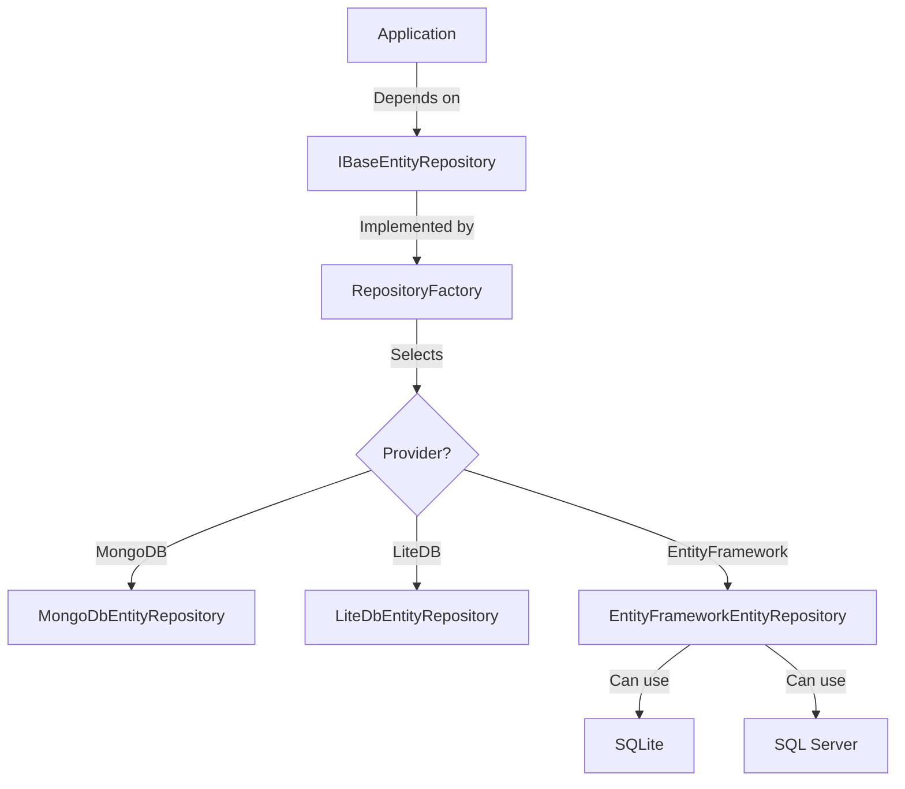

# Repository Factory

The Repository Factory is a key component of FluentCMS that enables seamless switching between different database providers through configuration rather than code changes.

## Overview

The Repository Factory is implemented as a wrapper around the specific database repository implementations. It dynamically selects the appropriate repository implementation based on configuration settings, allowing applications to switch databases without code changes.



## Key Components

### 1. RepositoryFactoryOptions

This class holds configuration options for all supported database providers:

```csharp
public class RepositoryFactoryOptions
{
    // Provider to use (e.g., "MongoDB", "LiteDB", "EntityFramework", "SQLite", "SqlServer")
    public string Provider { get; set; } = "MongoDB";
    
    // Options for each provider
    public MongoDbOptions MongoDB { get; set; } = new();
    public LiteDbOptions LiteDB { get; set; } = new();
    public EntityFrameworkOptions EntityFramework { get; set; } = new();
    public SqliteOptions SQLite { get; set; } = new();
    public SqlServerOptions SqlServer { get; set; } = new();
}
```

### 2. Provider Configurators

Each database provider has a configurator class that implements `IProviderConfigurator`:

```csharp
public interface IProviderConfigurator
{
    bool CanHandleProvider(string providerName);
    void ConfigureServices(IServiceCollection services, RepositoryFactoryOptions options);
    void ValidateConfiguration(RepositoryFactoryOptions options);
}
```

The configurator is responsible for:
- Determining if it can handle a specific provider name
- Setting up the necessary services in the dependency injection container
- Validating the configuration options

### 3. RepositoryFactory

The factory class itself implements `IBaseEntityRepository<TEntity>` and delegates calls to the appropriate repository implementation:

```csharp
public class RepositoryFactory<TEntity> : IBaseEntityRepository<TEntity> 
    where TEntity : class, IBaseEntity
{
    private readonly IBaseEntityRepository<TEntity> _repository;

    public RepositoryFactory(
        IOptions<RepositoryFactoryOptions> options,
        IServiceProvider serviceProvider)
    {
        _repository = CreateRepository(options.Value, serviceProvider);
    }

    private IBaseEntityRepository<TEntity> CreateRepository(
        RepositoryFactoryOptions options,
        IServiceProvider serviceProvider)
    {
        // Create the appropriate repository based on options.Provider
    }

    // IBaseEntityRepository implementation methods that delegate to _repository
}
```

### 4. ServiceCollectionExtensions

Extension methods that make it easy to register the repository factory:

```csharp
public static IServiceCollection AddRepositoryFactory(
    this IServiceCollection services, 
    IConfiguration configuration, 
    string sectionName = "Repository")
{
    // Register options and services
}
```

## Configuration

The repository factory is configured via appsettings.json or another configuration source:

```json
{
  "Repository": {
    "Provider": "MongoDB",
    
    "MongoDB": {
      "ConnectionString": "mongodb://localhost:27017",
      "DatabaseName": "FluentCMS"
    },
    
    "LiteDB": {
      "ConnectionString": "Filename=fluentcms.db;Connection=shared"
    },
    
    "EntityFramework": {
      "UseCamelCaseTableNames": true,
      "TableNamePrefix": "",
      "TableNameSuffix": "",
      "DefaultSchema": "dbo",
      "AutoMigrateDatabase": true
    },
    
    "SQLite": {
      "DatabasePath": "fluentcms.db",
      "EnableForeignKeys": true
    },
    
    "SqlServer": {
      "ConnectionString": "Server=(localdb)\\mssqllocaldb;Database=FluentCMS;Trusted_Connection=True;",
      "EnableRetryOnFailure": true,
      "MaxRetryCount": 5
    }
  }
}
```

## Usage

In Program.cs or Startup.cs:

```csharp
// Register the repository factory
builder.Services.AddRepositoryFactory(builder.Configuration);

// Use repository as usual via dependency injection
public class MyService
{
    private readonly IBaseEntityRepository<MyEntity> _repository;
    
    public MyService(IBaseEntityRepository<MyEntity> repository)
    {
        _repository = repository;
    }
}
```

## Benefits

1. **Configuration-Driven**: Switch database providers without code changes
2. **Consistent Interface**: All repositories implement the same interface
3. **Developer Flexibility**: Developers can use different databases in different environments
4. **Separation of Concerns**: Application code doesn't need to know about the specific database implementation
5. **Testability**: Easy to mock or substitute repositories in tests

## Supported Providers

- MongoDB
- LiteDB
- Entity Framework Core with:
  - SQLite
  - SQL Server

More providers can be added by implementing additional provider configurators.
